# Lambda Deploy

### What this is
Heroku seems to have figured out deployment for the basic cloud platform. Basically, Heroku creates a remote git repository, you push code to that and it is automatically deployed to Heroku, and is immediately made available. This Lambda function emulates that behavior. 

##### How it works
This Lambda function is invoked with the Push model, in the form of a webhook from Github sent to AWS API Gateway. When new code is pushed to github, this function pulls the code, compresses it into a zip file, and uploads it to the function with the ARN specified in the URL parameter. I've only tested this with Node.js, but it should work with Java and Python as well.

AWS Lambda is very restrictive on what you are allowed to do in terms of using the underlying filesystem of the machine. This function basically relies on GNU zip and unzip binaries compiled for linux running on x86_64. 

### Setup
* [Configure AWS IAM Role and Policy](#Configure AWS IAM Role and Policy)
* [Create the Lambda function and upload the code
](#Create the Lambda function and upload the code)
* [Configure AWS API Gateway](#Configure AWS API Gateway)
* [Configure Github Webhooks](#Configure Github Webhook)

##### Configure AWS IAM Role and Policy
Create a new Lambda Role

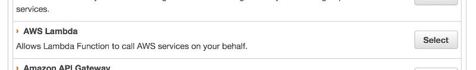

Attach the Lamda Full Access policy. We need to do this because we need to be able to call Lambda.updateFunctionCode

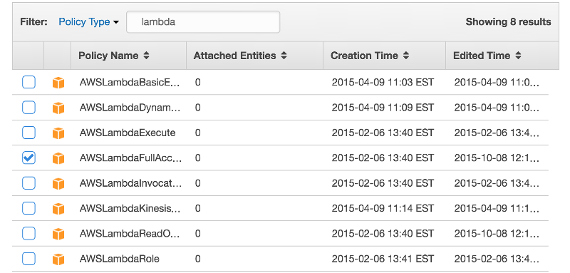

##### Create the Lambda function and upload the code

Download and zip the source code

```{sh}
$ git clone https://github.com/taylorking/lambdacd.git
$ cd lambdacd
$ npm install
$ zip -r upload.zip *
```

Create a new Lambda Function using your IAM role, and the zip file you just created

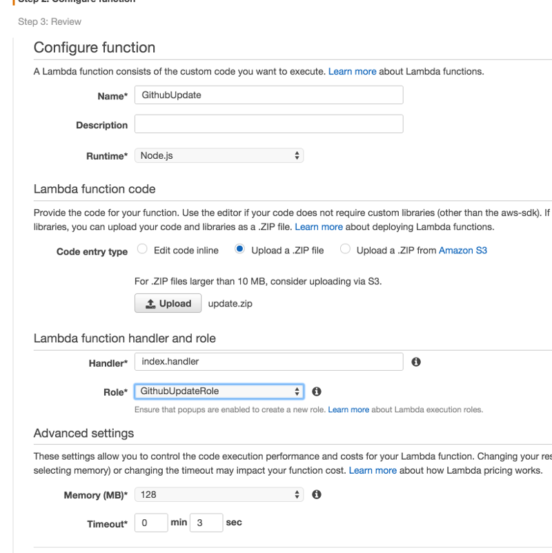

##### Configure AWS API Gateway

Create a new API

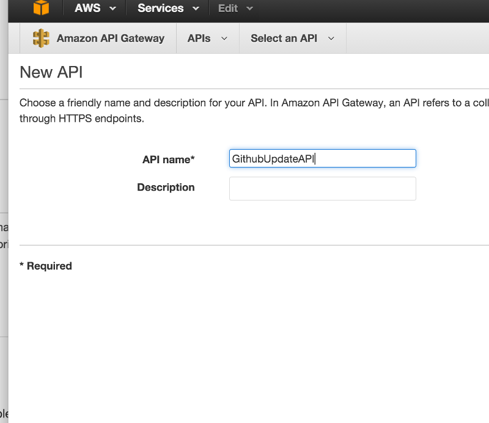

Create a new POST method

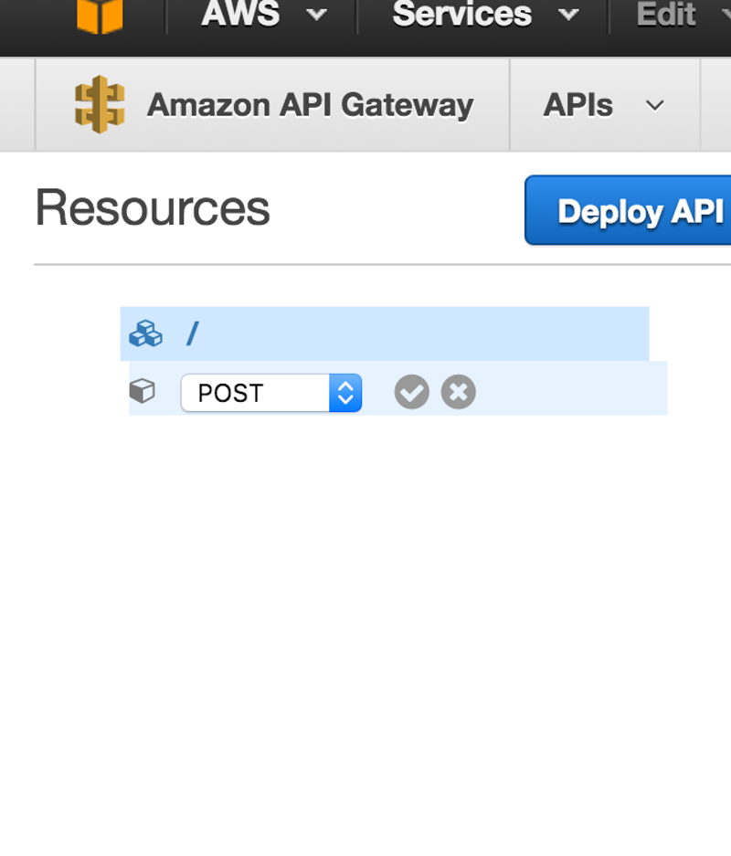

Configure the POST method to invoke the lambda function

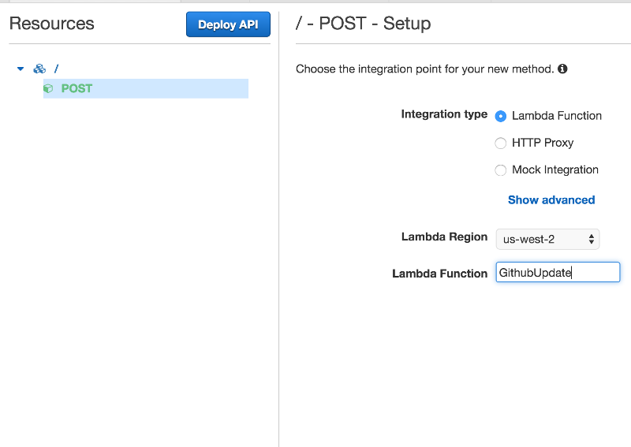

Configure the request url parameters

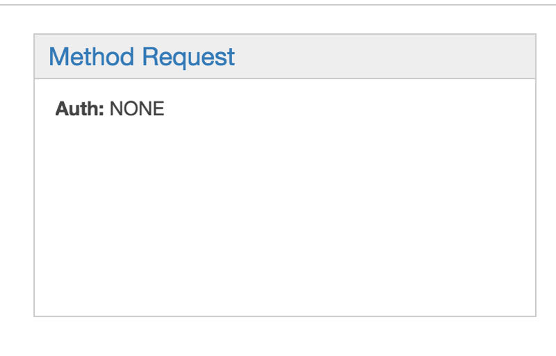
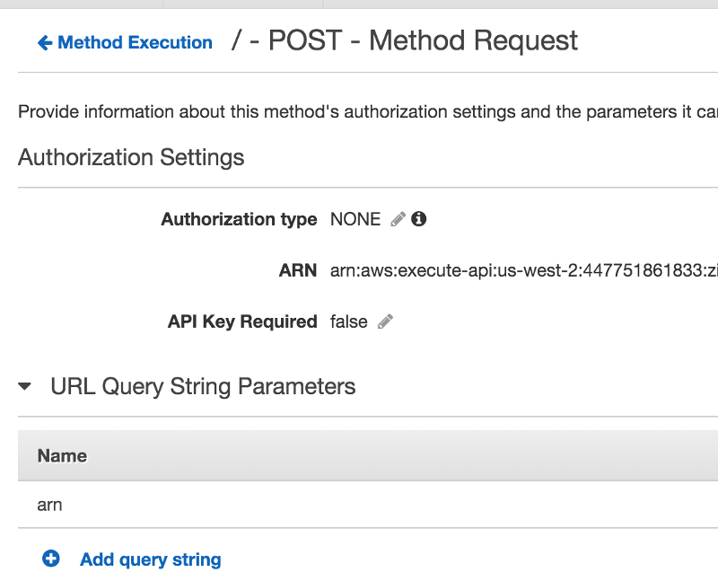

Create an Integration Request Mapping Template, and copy the code from inbound-integration-mapping-template.awsmappingtemplate

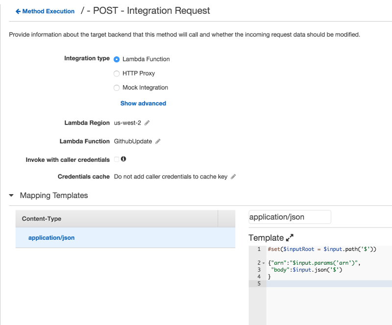

Stage and Deploy your API

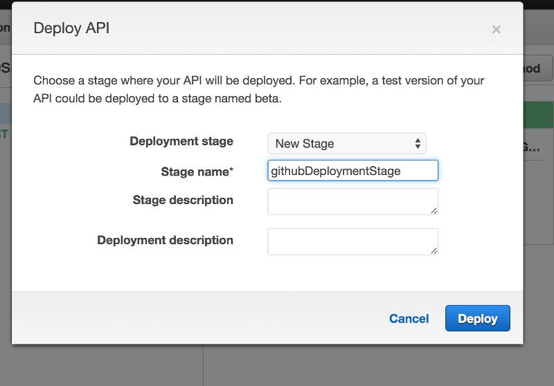

Note the invoke url for your api

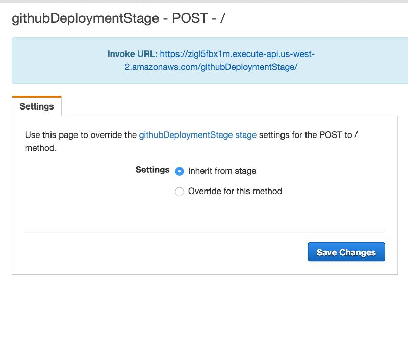

##### Configure Github Webhook

Note the arn for the Lambda function you want to deploy to

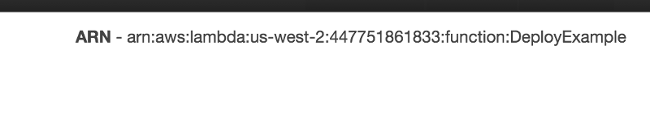

Configure the Github webhook in Repository Settings > Webhooks. The payload URL will be the Invoke URL from above, passing arn= the arn for your lambda function from above. For example, the url from my example was ```https://zigl5fbx1m.execute-api.us-west-2.amazonaws.com/githubDeploymentStage?arn=arn:aws:lambda:us-west-2:447751861833:function:DeployExample```


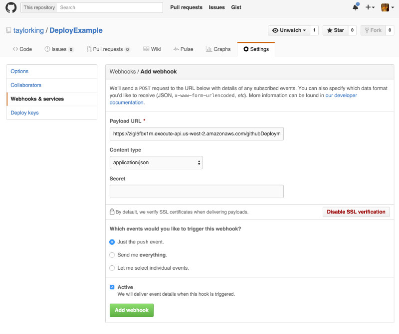


### Usage

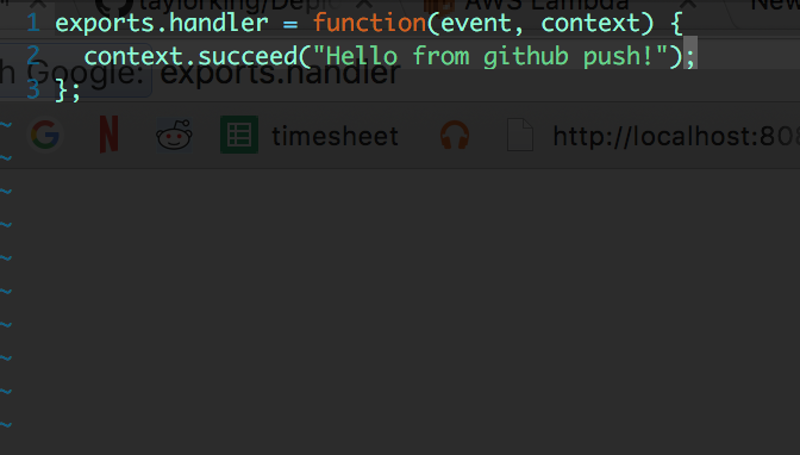

Push some code

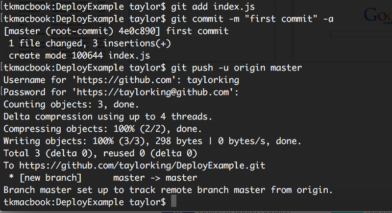

It has been uploaded to lambda

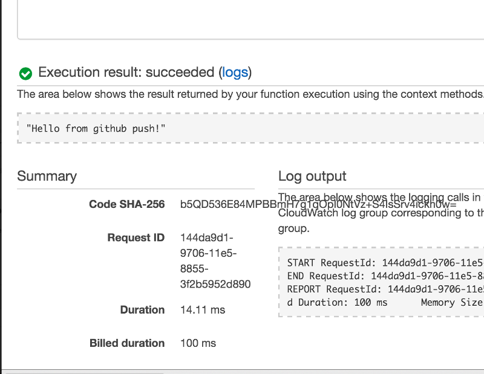
